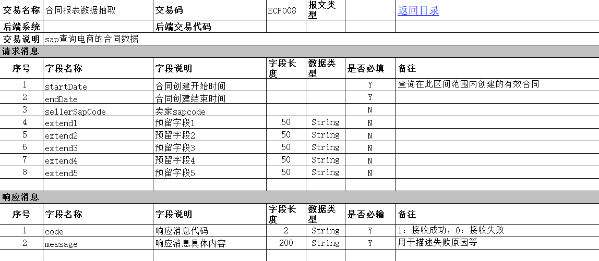
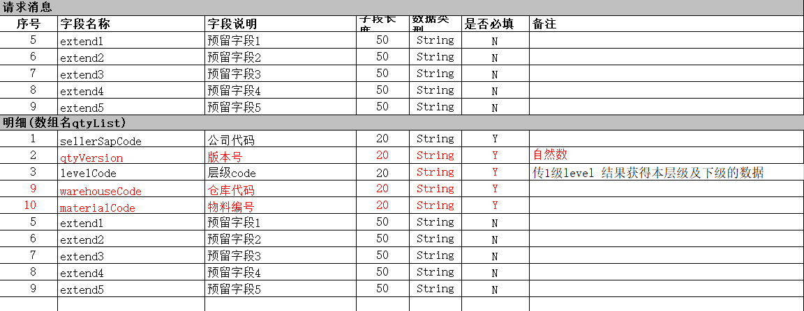
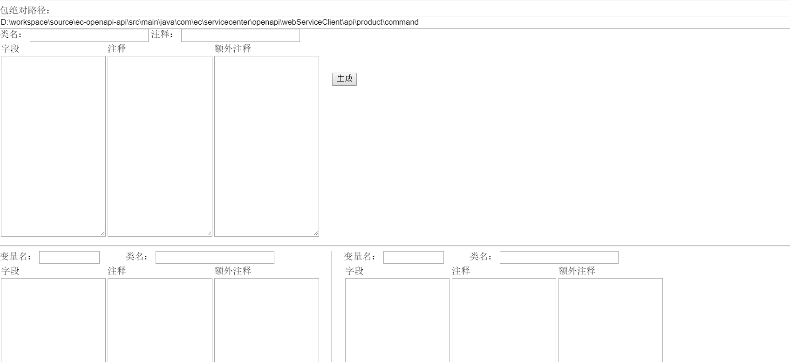

# electron-demo
一个Electron小程序，用于生成WebService接口代码

## 缘起
最近要写WebService，需要提供对外访问的接口和客户端调用的程序。大概如：
  
这样的接口大概有十几个，如果手动去创建请求类和响应类的话会相当费劲。  
想着写一个代码生成程序，能自动生成请求类和响应类。  
思路一：直接读取Excel数据，然后生成类。这种思路实现起来难度比较大的，因为Excel中的格式不是很固定，有的请求消息还带着明细类、需要用到集合，如：
  

---

思路二：我自己按照预定规则填写一些信息，然后生成代码。这种思路还是比较可行的，程序员就是把现实世界的复杂转换为软件世界的秩序的。

## 选型
因为我对Java比较熟悉，第一时间想到的是Java，技术栈大概是FreeMarket+Spring MVC。但问题是用Spring MVC的话，需要启动Web容器，还是相对复杂。  
想到使用图形界面的方式可能会更好，加上自己对node还算熟悉，就使用了比较流行的Electron。  
做出来界面如下：
  
生成的代码会直接保存到相应的地址，在IDE中刷新一下即可得到对应的类。  
